# networkinglab
## URL DATA
para cada uno de los valores generamos el print el cual podemos encontrar en el archivo URLData.java, y para la siguiente URL:  
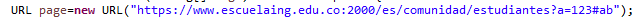  
recibimos los siguientes valores:  
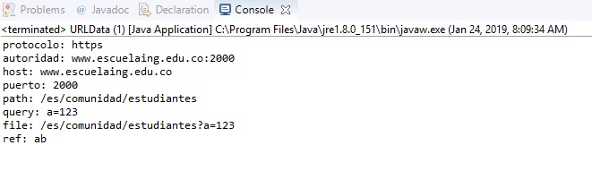  

como notamos nos desglosa toda la informacion de la URL y cada parametro que fue solicitado

## URL READER	
a diferencia del anterior, en este programa se accedera a internet y se creara una copia HTML de la pagina solicitada  
lo primero que hacemos es ejecutar el main de la clase URLReader  
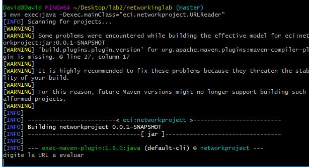  
posteriormente escribiremos la URL de la pagina  
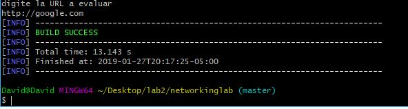  
el archivo se guardara en la carpeta raiz de nuestro projecto con el nombre resultado.html.  
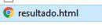  
finalmente al abrirlo notamos que no la pagina no esta completa ya que le faltan componentes, esto se debe a que  
se guardo estrictamente el html de la pagina y no puede encontrar los demas componentes para cargarla correctamente.   
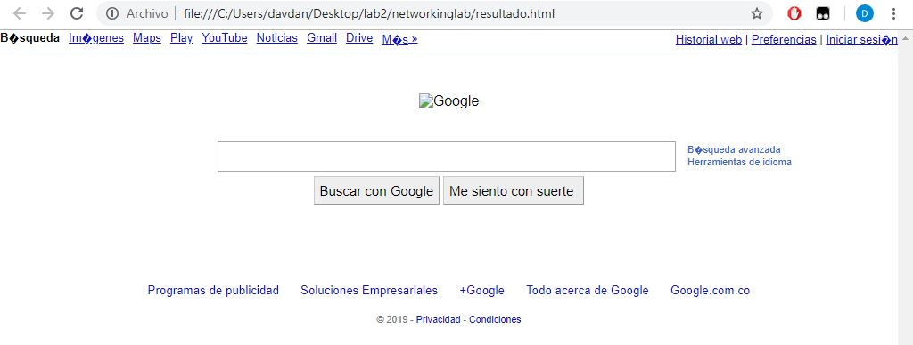  

## respuesta de numero al cuadrado.
para este punto se debe modificar el archivo EchoServer.java que fue suministrado, la modificacion puede encontrarse  
en el archivo CuadradoServer.java.  
primero que todo iniciamos el servidor desde maven:  
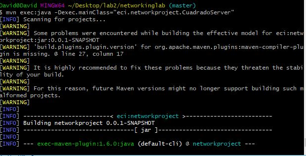  
dado que necesitamos un cliente lo inicializamos desde una consola aparte:  
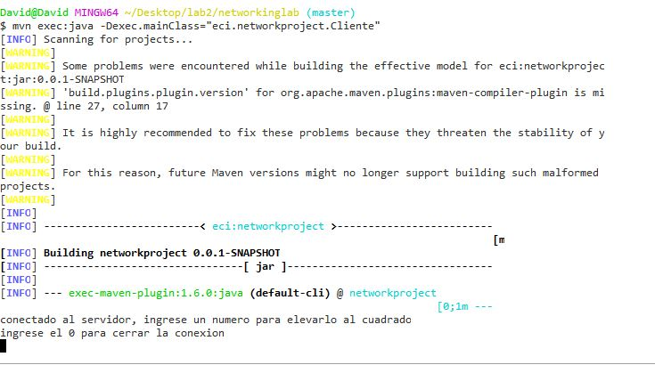  
se agrego un mensaje al servidor para evidenciar que efectivamente el cliente se conecto, finalmente probamos  
que este funcionando correctamente:  
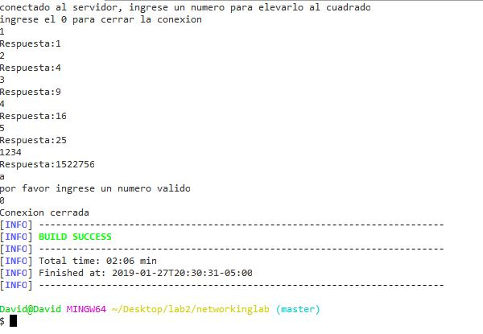  
y finalmente evidenciamos que el servidor tambien cerro su conexion:  
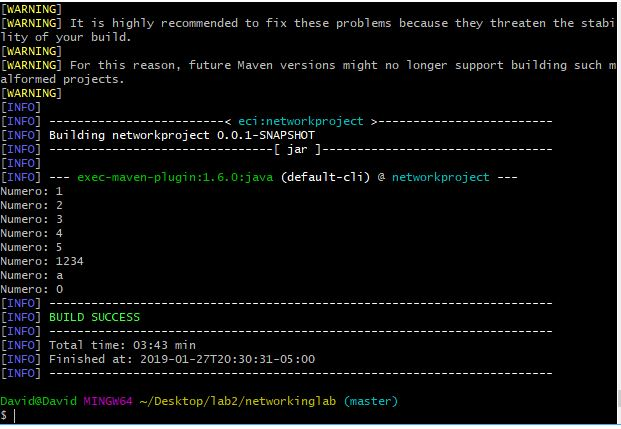  

## funciones trigonometricas
al igual que el anterior, se debe modificar EchoServer.java, en este caso la modificacion se llama TrigonometricasServer.java  
se puede usar el mismo cliente que en el casos anterior, (Cliente.java)  
inicializamos el servidor y el cliente:  
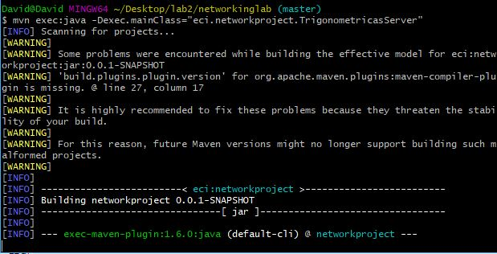  
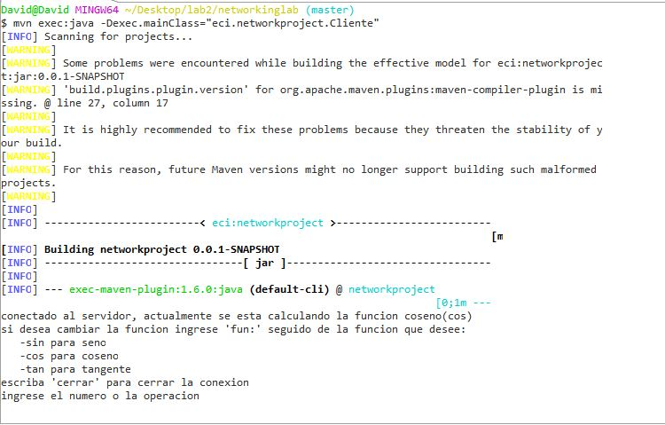  
posteriormente probamos que este funcionando correctamente:  
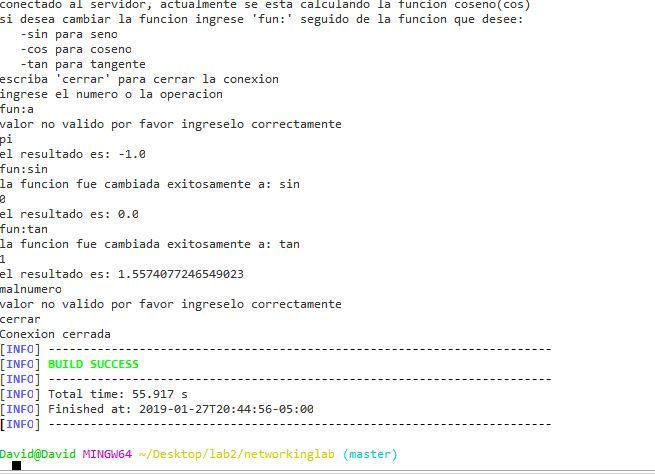  
y finalmente evidenciamos que el servidor tambien cerro su conexion:  
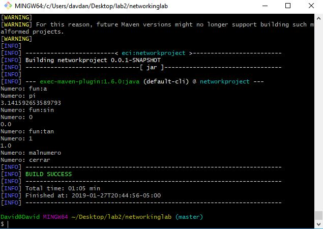  

