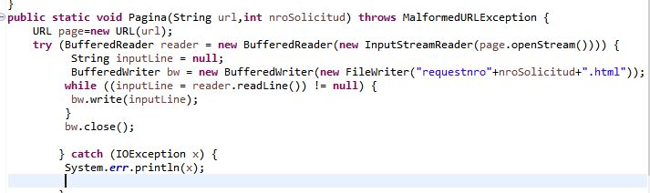

# Clientes y servicios

## Iniciando
las siguientes instrucciones son para correr y desplegar el proyecto localmente
### prerequisitos
- Maven 3.6. en caso de no tenerlo seguir las siguientes instrucciones de acuerdo al sistema operativo . [How to install maven](https://maven.apache.org/install.html)
 - JDK (Java Development Kit) 1.8. en caso de no tenerlo seguir las siguientes instrucciones. [Java SE Development Kit 8](https://www.oracle.com/java/technologies/jdk8-downloads.html)
 - Git bash. en caso de no tenerlo seguir las siguientes instrucciones [GIT](https://git-scm.com/) y aqui una documentación. [GIT DOCS](https://git-scm.com/docs)
 ### instalacion y despliegue local
 Clonar el proyecto:

    git clone https://github.com/darm145/Lab3Arep

navegar en los archivos con cd hasta estar en la raiz del proyecto

    cd Lab3Arep

compilarlo y ejecutarlo

    mvn package
    mvn exec:java-Dexec.mainClass="eci.networkproject.{clase a correr}"

la clase a correr depende del servidor a testear.
## URL DATA
para cada uno de los valores generamos el print el cual podemos encontrar en el archivo URLData.java, y para la siguiente URL:  
  
recibimos los siguientes valores:  
  

como notamos nos desglosa toda la informacion de la URL y cada parametro que fue solicitado

## URL READER	
a diferencia del anterior, en este programa se accedera a internet y se creara una copia HTML de la pagina solicitada  
lo primero que hacemos es ejecutar el main de la clase URLReader  
  
posteriormente escribiremos la URL de la pagina  
  
el archivo se guardara en la carpeta raiz de nuestro projecto con el nombre resultado.html.  
  
finalmente al abrirlo notamos que no la pagina no esta completa ya que le faltan componentes, esto se debe a que  
se guardo estrictamente el html de la pagina y no puede encontrar los demas componentes para cargarla correctamente.   
  

## respuesta de numero al cuadrado.
para este punto se debe modificar el archivo EchoServer.java que fue suministrado, la modificacion puede encontrarse  
en el archivo CuadradoServer.java.  
primero que todo iniciamos el servidor desde maven:  
  
dado que necesitamos un cliente lo inicializamos desde una consola aparte:  
  
se agrego un mensaje al servidor para evidenciar que efectivamente el cliente se conecto, finalmente probamos  
que este funcionando correctamente:  
  
y finalmente evidenciamos que el servidor tambien cerro su conexion:  
  

## funciones trigonometricas
al igual que el anterior, se debe modificar EchoServer.java, en este caso la modificacion se llama TrigonometricasServer.java  
se puede usar el mismo cliente que en el casos anterior, (Cliente.java)  
inicializamos el servidor y el cliente:  
  
  
posteriormente probamos que este funcionando correctamente:  
  
y finalmente evidenciamos que el servidor tambien cerro su conexion:  
  

## servidor paginas html e imagenes
para este punto podemos modificar ligeramente el codigo URLReader de tal manera que en vez de buscar una sola pagina  
podamos buscar las que deseemos y cada una de ellas guardarla con un nombre distinto, la modificacion es la siguiente:  
  
posteriormente ponemos a correr el cliente y el servidor:  
  
  
y probamos que este funcionando correctamente:  
  
  
y verificamos que el servidor tambien cierra la conexion:  
  
## Servidor datagramas(hora)
para el siguiente servidor usamos los codigos suministrados y les aplicamos ciertas modificaciones para que cumplan 
los requerimientos solicitados, dichas modificaciones se pueden encontrar en el codigo fuente.  
procedemos a inicar el servidor:  
  
a continuacion procedemos a iniciar el cliente y que empiece a recibir los datagramas inmediatamente:
  
como vemos funciona correctamente, para finalzar realizamos la prueba cerrardo el servidor y volviendolo a iniciar 
donde obtenemos lo siguiente:
 
y notamos que esta funcionando correctamente segun las especificaciones dadas.

## Construido con
[Maven](https://maven.apache.org/) - Dependency Management

## Autor
David Daniel A. Ramirez Moreno- [GitHub](https://github.com/darm145) - Escuela Colombiana de Ingeniería Julio Garavito

## License
This project is under GNU General Public License - see  [LICENSE](https://github.com/darm145/Lab3Arep/blob/master/LICENSE) to more info.